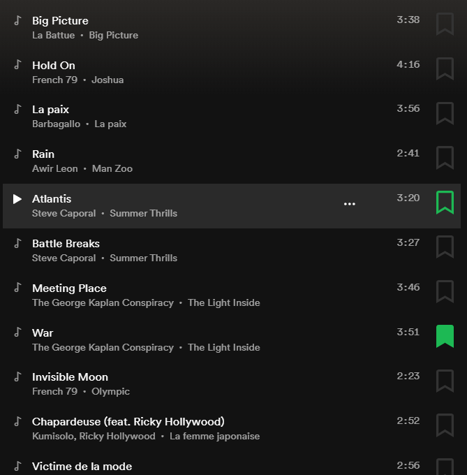

# SpotiMark

Chrome Extension to bookmark your favorite songs inside of playlists

## Installation 

The app is not yet on the Google Store. To add it to your browser, clone the repository, and add the folder to Chrome extensions by enabling developer mode in chrome://extensions , then click on "load unpacked extension" to select the folder.

It works also on every chromium-based browser as the last Microsoft Edge ( edge://extensions )

